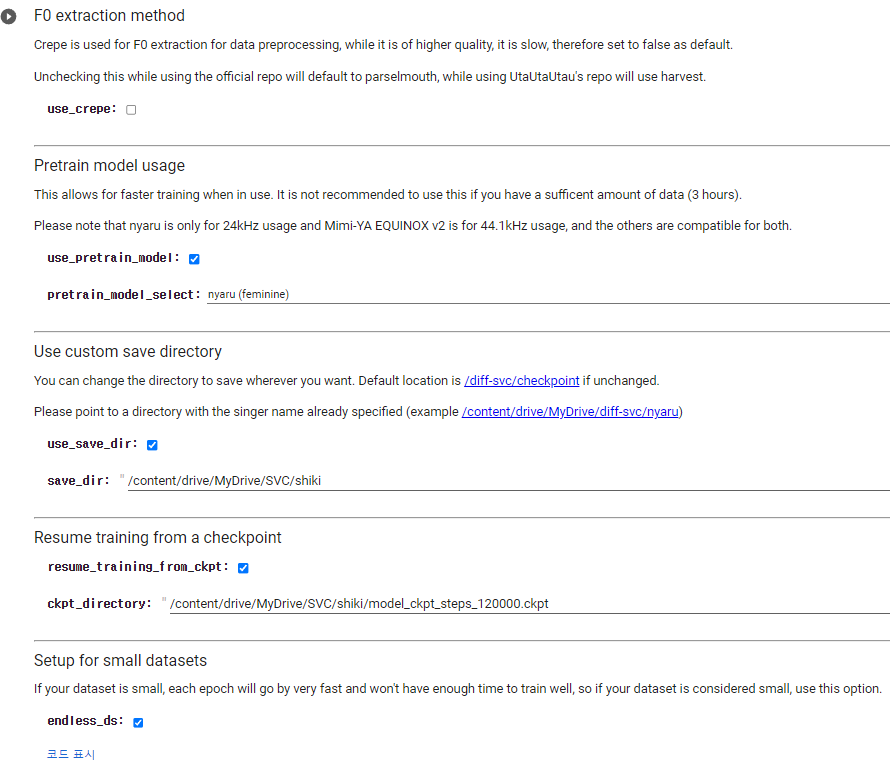
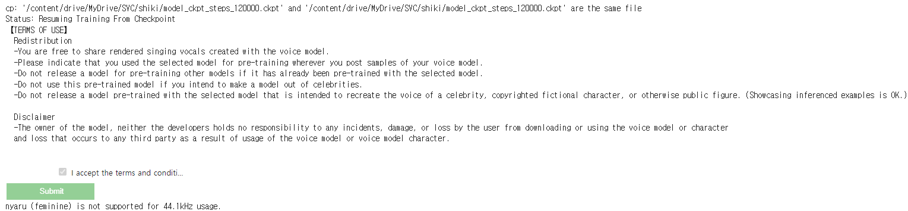

<br>

## 모델 다운받기

먼저 이 모델을 사용하기에 앞서, 이 모델 제작자가 이미 코렙으로 만들어 놓았다.
[모델.ipynb](https://colab.research.google.com/drive/1kiUvz1TrNJa_MOfOld7DHanv4gZsl7MN)에 들어가보면 제작자가 만들어놓은 코랩 노트북이 있다.

처음을 보면 모델을 다운로드하게 되어있다.

~~신기하게 마크다운으로 GUI를 구현했다.~~


여기서 우리가 건드릴 것은 없다.

다만 이 모델은 항상 **44.1khz** sr과 **모노**형식의 **wav** 파일의 음성 데이터만 받으니 주의하자.

이제 실행 버튼을 누르면 폴더에 **diff-svc**라는 폴더가 생긴다.

## 모델 설정하기


singer_name: 가수 이름
cleanup: 전부 다 지우고 할 껀지(체크하면 다 밀고 하니, 이전에 했던 사람이라면, 미리 백업해두고 하자)
increase_range: 데이터 음역대가 낮은 경우에는 체크
clean_up: 기존에 있던 학습 데이터를 지울 것인가(체크 할꺼라면 미리 백업해 두자)  
dataset_location: 학습시킬 데이터들이 들어있는 파일 위치(zip 파일이여야 함)

설정을 하고 실행하면, zip파일에서 데이터를 가져와 `./diff-svc/data/raw/singer_name/`에 오디오 파일이 저장되는 것을 확인할 수 있다.

2-A는 건너뛰어도 괜찮다.

## Training option / Parameters



이제 옵션을 선택할 차례다.

여기서 첫 번째는 use_crepe는 체크 해제한다.  
use_pretrain_model: 기존에 학습된 데이터를 사용할 것인가.  
체크 해제하면 너무 많은 시간과 데이터가 필요하므로 체크한다.  
use_save_dir: 훈련파일 저장 위치  
resume_training_from_ckpt: 훈련한 데이터가 있는지(자신이 만든 훈련데이터를 그대로 사용할 것인가.)  
endless_ds: 배치사이즈를 늘려서 작은 크기의 데이터셋의 품질을 향상시키는 옵션(가지고있는 데이터가 1시간 미만이라면 체크)

그대로 실행하게 되면



이런식으로 문구가 하나 뜨게 된다.

이건 앞서 체크한 use_pretrain_model. 즉, 베이스가 되는 데이터를 다운하는 과정이라고 볼 수 있다.

## Pre-processing

이제부터가 진짜다.
데이터를 훈련할 수 있도록 전처리 해주는 과정인데, 대충 600개에 50분정도 걸렸다는 사람도 있고, 나는 로컬에서 했을 때, 1000 ~ 2000개 정도에 3 ~ 4시간 정도 걸린 것 같다.

## Training

이젠 별거 없다.

전처리가 끝난 데이터로 훈련을 하고 목소리르 입히고, 반주와 합성하면 끝이다.  
하지만 코랩을 쓰려고 하니 시간 제한(12시간)도 있고, 속도도 좀 느리고 해서 이 파일을 로컬로 가져와 작업하려고 했다.

난 윈도우 운영체제를 사용하기 때문에, 리눅스 기준으로 쓰여진 코드를 윈도우에 맞게 수정할 필요가 있었다.

##코드 수정하기

코드들을 보면 리눅스에 맞춰저있다 보니, `rm`, `sudo`, `unzip` 등이 보인다.

코랩에서 수행하자니, 속도가 느리기도 하고, 최대 12시간밖에 못 사용하기 때문에, 로컬에서 코드를 수행하기 위해, 코드를 일부 수정하려고 한다.

### `rm -rf sample_data`

sample_data 폴더를 지우는 코드다. 이걸 윈도우에서 사용할 수 있게끔 바꿔줘야 한다.

`rm -rf sample_data` -> `rmdir /s sample_data`

### `sudo apt-get install aria2  &> /dev/null`

aria2를 다운받는데, 그로인해 발생하는 모든 출력을 표시하지 않는다.

기본적으로 aria2는 리눅스에서 사용하기 때문에 윈도우같은 경우, 따로 설치해주어야 한다.

[aria2 다운로드](https://aria2.github.io/)  
위 링크를 가면 프로그램을 다운로드 할 수 있고 환경변수에 추가해 주면 된다.

### `echo 1|./aria2.sh &> /dev/null`

aria2에 1을 보낸다. 그리고 aria2는 그 입력값으로 해당 작업을 수행한다. 그리고 출력을 하지 않는다.

사실 이건 크게 건들지 않았던거 같다.

### `wget "..." -O {config_path} -q`

wget명령어는 리눅스 명령어고, 윈도우에서는 기본적으로 지원하지 않는다.  
그 대신 **wget** 대신 **curl**를 사용할 수 있다.

```python
os.system('curl {html} -O {저장 위치})
```

이런식으로 코드를 바꾸는데 **sed -i -r 's|checkpoints/\{args.work_dir}|haruprivatewashere|g' /content/diff-svc/utils/hparams.py** 이 코드에서 문제가 발생했다.

파일로 들어가 파일 안의 내용을 바꾸는 코드같은데 이것을 처음에 powershell를 통해 바꾸려고 했다.

```python
os.system(f'powershell.exe "(Get-Content -Path \'{config_path}\') -replace \'(max_sentences:)(\s+)(.+)\', \'\\1\\2{batch_size}\' | Set-Content -Path \'{config_path}\'"')
```

이런식으로 바꾸려고 했으나 계속 어디선가 오류가 발생하여 그냥 윈도우에 wsl 가상환경을 설치하여 시도하기로 했다.

## wsl 설치

powershell를 관리자 권한으로 치고 ubuntu 설치 명령어를 썼다.
`wsl.exe --install -d Ubuntu-20.04`

그럼 알아서 설치해준다.
원래 코드도 코랩에서 실행했기 때문에 같은 환경이 우분투에서 코드의 수정 없이 실행이 가능했다.

## 성우 목소리 학습

두 번째 캐글 데이터를 이용해 학습을 진행했다.  
전처리 단계에서 약 4시간, 학습하는데 약 15시간 정도 소모했다.

이렇게 학습만 성우 목소리로 `아이유 - 좋은날` 노래를 부르게 해 보려고 한다.
